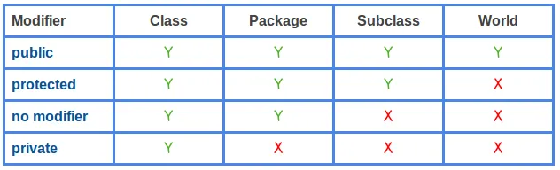

# 9-2. 접근 수준 지시자 (Access-level Modifiers)

- 면접 빈출…! (특히 default까지는 잘 모른다고 함)
- 한글 표현이 다양해서 영어 표현을 기억해 두는 것이 좋음

> **public(all) > protected(상속) > default(package-private)(package) > private(class)**
>



- 클래스 정의 대상
    - public, default
- 인스턴스 변수와 메소드 대상
    - public, protected, private, default

## 클래스 정의 대상의 public과 default 선언이 갖는 의미

- public
    - 위치에 상관없이 어디서든 해당 클래스의 인스턴스를 생성할 수 있음
    - 하나의 소스파일에 하나의 클래스만 public으로 선언 가능
    - 소스 파일의 이름과 public으로 선언된 클래스의 이름을 일치시킨다
- default
    - 동일 패키지로 묶인 클래스 내에서만 인스턴스 생성 가능

**⇒ 지키지 않으면 컴파일 오류가 발생**

## 인스턴스 멤버의 public과 default 선언이 갖는 의미

- 인스턴스 멤버 : 인스턴스 변수와 메소드
- 접근은 변수의 경우 말 그대로 접근이지만, 메소드의 경우 호출을 의미함

## 인스턴스 멤버의 private 선언이 갖는 의미

```java
class Duck {
	private int numLeg = 2; // 클래스 내부에서만 접근 가능
	
	public void md1(){
		System.out.println(numLeg); // 접근 가능
		md2(); // 호출 가능
	}

	private void md2(){
		System.out.println(numLeg); // Duck 클래스에 정의된 메소드에서만 접근 가능
		md2(); // 호출 가능
	}

	void md3(){
		System.out.println(numLeg); // 접근 가능
		md2(); // 호출 가능
	}
}
```

## 인스턴스 멤버의 protected 선언이 갖는 의미

- protected 선언은 default 선언이 허용하는 접근을 모두 허용한다
- 더불어 protected는 default가 허용하지 않는 ‘한 영역'에서의 접근도 허용한다
- protected로 선언된 멤버는 상속 관계에 있는 다른 클래스에서 접근 가능함 (다른 패키지여도)

⇒ ‘한 영역'은 클래스의 상속 관계에서 만들어짐

```java
public class AAA {
	protected int num;
}

public class ZZZ extends AAA {
	public void init(int n){
		num = n; // 상속된 변수 num의 접근
	}
}
```