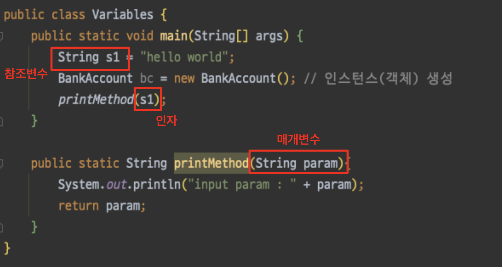

# 클래스, 인스턴스, 클래스 패스

- 클래스(Class) = 데이터(Data) + 메소드(Method)

## 클래스의 정의와 인스턴스의 생성

- 데이터는 ‘변수의 선언'을 통해 유지 및 관리되고 변수에 저장된 데이터는 ‘메소드의 호출'을 통해 처리됨
- 연관 있는 변수와 메소드를 묶기 위해 ‘클래스'라는 것이 존재함
- 클래스 정의 : 멤버 변수와 멤버 메소드
    - 인스턴스 변수 : 클래스 내에 선언된 변수 (멤버 변수, 필드 Field)
    - 인스턴스 메소드 : 클래스 내에 정의된 메소드

    ```java
    class BankAccountPO {
    	// 인스턴스 변수
    	int balance = 0; 
    
    	// 인스턴스 메소드
      public int deposit(int amount) {
          balance += amount;
          return balance;
      }
      public int withdraw(int amount) {
          balance -= amount;
          return balance;
      }
      public int checkMyBalance() {
          System.out.println("잔액 : " + balance);
          return balance;
      }
    }
    ```

>- 인스턴스 변수는 같은 클래스 내에 위치한 메소드 내에서 접근이 가능함  
>- 인스턴스 변수가 선언된 위치는 메소드 내부가 아니므로 지역변수와는 성격이 다름
>

- 클래스의 정의는 틀(Mold)을 구성하는 것과 같다
    - 인스턴스 - 틀로 찍어낸 객체
    - 클래스의 인스턴스화 → 이 이후에 실제 메모리 공간에 존재하게 됨

        ```java
        new BankAccount();
        ```

### 참조변수 Reference Variable

- 만들어진 인스턴스를 참조할 수 있는(가리키고 있을 수 있는) 무언가
- 참조 선언

    ```java
    BankAccount myAcnt1;
    myAcnt1 = new BankAccount(); // 참조변수 myAcnt가 새로 생성되는 인스턴스를 가리킴
    
    BankAccount myAcnt2 = new BankAccount();
    
    ```

- 키워드 new를 통해서 인스턴스를 생성하면 생성된 인스턴스의 주솟값이 반환됨
- 두 개의 참조변수가 하나의 인스턴스를 참고하는 것도 가능

    ```java
    BankAccount ref1 = new BankAccount();
    BankAccount ref2 = ref1;
    ```

- 메소드를 호출하면서 인스턴수의 참조값 전달 가능

    ```java
    public static void main(String[] args) {
        BankAccount ref = new BankAccount();
        check(ref); // 참조값 전달
    }
    
    public static void check(BankAccount acc){
        acc.checkMyBalance();
    }
    ```

- 참조변수가 참조하는(가리키는) 인스턴스와의 관계를 끊고 아무런 인스턴스도 참조하지 않도록 하려면, 참조변수에 null을 대입하면 됨

> 확장자가 class인 클래스 파일은 정의되는 클래스의 수만큼 생성됨  
정의된 클래스 수 == 생성되는 클래스 파일의 수
>

## 생성자(Constructor)와 String 클래스의 소개

- 매개변수로 String형 참조변수를 선언하여 문자열을 인자로 전달받을 수 있다.
- 인스턴스 생성 과정에서 적절한 초기화가 필요함



### 생성자 (Constructor)

- 인스턴스가 생성될 때 각 인스턴스를 구분할 것이 필요함 **⇒ *생성자***
- 인스턴스 초기화를 위한 메소드임
- 때문에 인스턴스 생성 시 반드시 한번 호출해서 초기화를 진행함
- 인스턴스 생성 시 매개변수로 전달하면, 생성자의 매개변수로 전달됨
- 인스턴스 생성 마지막 단계에서 생성자가 호출되면서 값들이 전달되고, 이 값들로 인스턴스 변수가 초기화됨

```java
// 생성자
public BankAccountConstructor(String accNumber, String ssNumber, int balance) {
    this.accNumber = accNumber;
    this.ssNumber = ssNumber;
    this.balance = balance;
}
```

> 인스턴스 생성의 마지막 단계는 생성자 호출임  
어떠한 이유로든 생성자 호출이 생략된 인스턴스는 인스턴스가 아니다
>

### 디폴트 생성자 (Default Constructor)

- 생성자를 생략한 상태의 클래스를 정의하면 자바 컴파일러가 ‘디폴트 생성자'를 클래스 저으이에 넣어줌
- 그래도 생성자는 직접 정의해주는 것이 좋다
- 생성자가 필요 없는 클래스는 잘 정의된 클래스가 아닐 확률이 높기 때문

## 자바의 이름 규칙 (Naming Rule)

1. 클래스 이름 규칙
    - Camel Case 모델
2. 메소드와 변수 이름 규칙
    - 변형된 Camel Case (첫 문자를 소문자로 시작함)
3. 상수 이름 규칙
    - 변수 이름과 구분되도록 모든 문자를 대문자로 구성
    - 둘 이상의 단어를 연결하는 경우, 언더바로 연결
---

### 참고

윤성우의 열혈 Java 프로그래밍 (Chapter 7)  
[https://bskyvision.com/795](https://bskyvision.com/795)